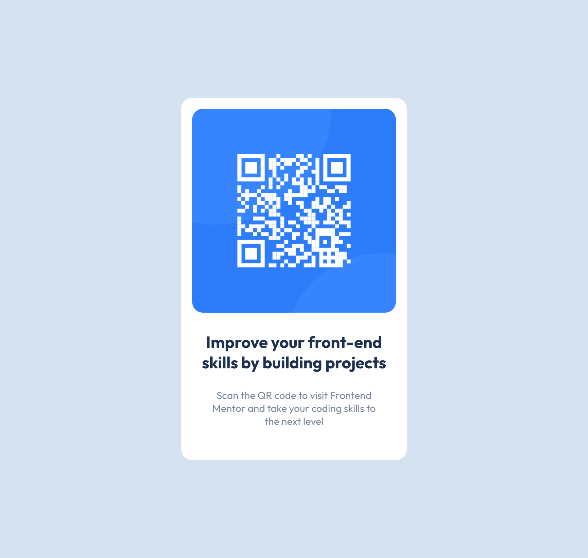

# Frontend Mentor - QR code component solution

This is a solution to the [QR code component challenge on Frontend Mentor](https://www.frontendmentor.io/challenges/qr-code-component-iux_sIO_H). Frontend Mentor challenges help you improve your coding skills by building realistic projects. 

## Table of contents

- [Overview](#overview)
  - [Screenshot](#screenshot)
  - [Links](#links)
- [My process](#my-process)
  - [Built with](#built-with)
  - [What I learned](#what-i-learned)
- [Author](#author)

**Note: Delete this note and update the table of contents based on what sections you keep.**

## Overview
Creating a QR Code component was the first beginner challenge offered on Front End Mentors. I have used this opportunity to learn Vue and to sharpen my vanilla CSS skills.

### Screenshot

### Links

- Live Site URL: [Add live site URL here](https://your-live-site-url.com)

## My process

### Built with

- HTML5 markup
- CSS custom properties
- Flexbox
- Mobile-first workflow
- [Vue](https://vuejs.org/) - JS framework

### What I learned

Vue uses bindings to dynamically assign variables to html and component attributes. I ran into some trouble when trying to link an image path from the Card component's props to an image tag because I was not binding the prop correctly. In the end, the problem was resolved by adding a colon to the start of the img tag's src attribute ":src" which is a shorthand for "v-bind:src". 

## Author

- Website - [Portfolio](https://portfolio-vyonyx.vercel.app/)
- Frontend Mentor - [@Vyonyx](https://www.frontendmentor.io/profile/Vyonyx)

